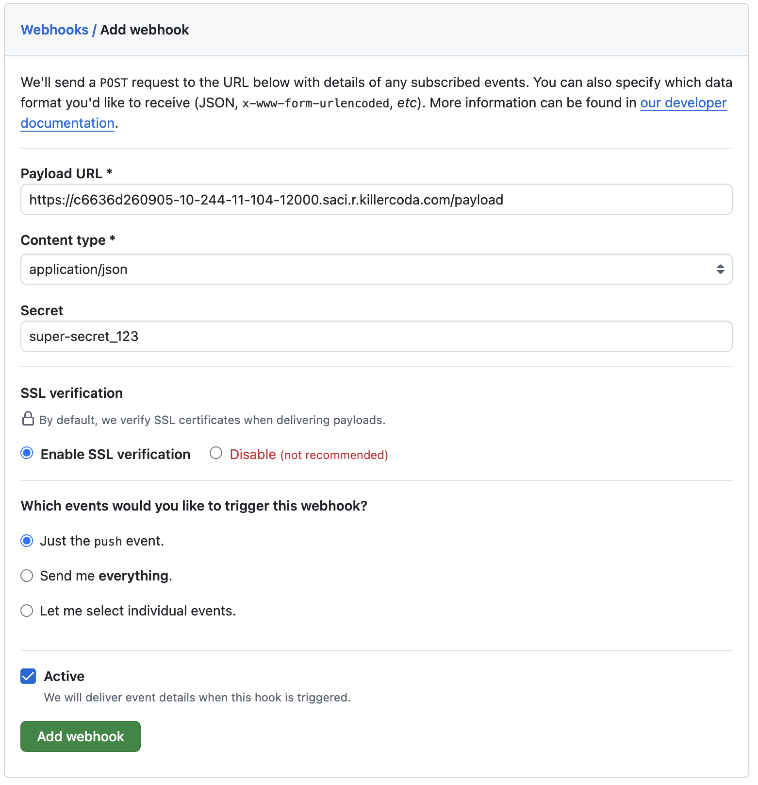
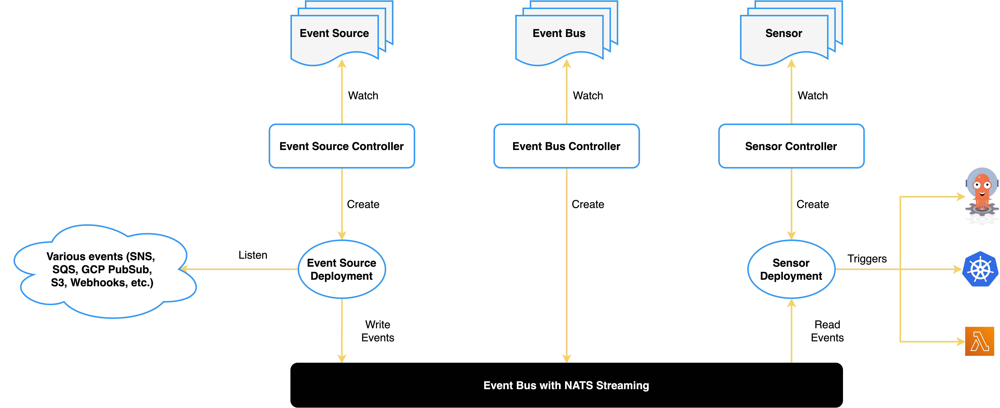

# Argo Events

Se trata de un framework de automatización _"event-driven"_ de Kubernetes que ayuda a ejecutar objetos de K8s, Argo Workflows y servicios serverless, entre otros, como se aprecia en la Figura 2.


Figura 2. Fuentes de Argo Events.

Para nuestro caso, usaremos Argo Events para la detección de cambios en un repositorio; de forma que, al detectarse un evento de `commit` en el repo, Argo Events recibirá el webhook desde el repositorio Git para activar el Workflow de nuestro pipeline. Para lograrlo, tendremos que configurar 3 tipos de objetos:

1. `EventSource`: define la fuente de información del evento. Registra los secretos necesarios para obtener información.
2. `Sensor`: especifica qué tipo de `Trigger` activar dependiendo del tipo de evento detectado por el `EventSource`.
3. `Trigger`: ejecuta una acción (Workflow) ante la detección de un evento.

Como estamos usando un patrón basado en GitOps, los manifiestos que desplegaremos de Argo Events se harán a través del repositorio Git que relacionamos en la sección anterior (Argo CD).

## 1. Estructura del repositorio

Antes de empezar, recordemos la estructura base de nuestro repositorio:

```text
<repo>/
  ├── argo/
  |     ├── workflows/
  |     |       ├── README.md
  |     |       ├── kustomization.yaml
  |     ├── events/
  |     |       ├── README.md
  |     |       ├── kustomization.yaml
  |     ├── kustomization.yaml
LICENSE
README.md
```

Todos los manifiestos de K8s de Argo Events que vamos a gestionar los crearemos en el path: `argo/events`.

## 2. Event Source

El _"Event Source"_ permite vincular el repositorio Git con nuestro clúster de Kubernetes a través de un __Webhook__ del repositorio Git. Para lograrlo, iniciaremos registrando el manifiesto del `EventSource` en nuestro clúster, lo que habilitará un nuevo _service_, dentro del namespace `argo-events`, llamado __`svc/github-eventsource-svc`__. Luego, expondremos el service para habilitar la URL pública del __payload__ que GitHub usará para el envío de información de los eventos. Una vez gestionada la URL, configuraremos el Webhook en el repositorio de GitHub para habilitar el envío de información.

### 2.1. Registro del `EventSource`

El `EventSource` es el objeto de K8s, de Argo Events, que vincula el clúster con el Webhook del Git repository. El Webhook requiere tres argumentos para poder ser registrado:

* __Payload Url:__ es la URL de conexión pública que GitHub usará para comunicarse con nuestro clúster. Lo obtendremos en la sección 2.2 y registraremos en GitHub en la sección 2.3.
* __Content Type:__ compete a la forma en como se desea transmitir la información. Usaremos `application/json`.
* __Secret:__ se emplea para firmar la información del evento y garantizar su procedencia. Ayuda a evitar ataques de tipo ["man in the middle"](https://www.ibm.com/think/topics/man-in-the-middle).

Para hacer el registro, empezaremos por definir el `secret` de la conexión del Webhook.

```yaml
apiVersion: v1
data:
  secret: c3VwZXItc2VjcmV0XzEyMw==
kind: Secret
metadata:
  name: webhook-secret
  namespace: argo-events
```{{copy}}

Ahora, crearemos el `EventSource` de la siguiente forma:

```yaml
apiVersion: argoproj.io/v1alpha1
kind: EventSource
metadata:
  name: github
  namespace: argo-events
spec:
  service:
    ports:
      - name: git-push
        port: 12000
        targetPort: 12000
  github:
    git-push:
      repositories:
        - owner: jdarguello
          names:
            - Spring-Taller6-CuentaBancaria
            - InversionVirtual
      webhook:
        endpoint: /payload
        port: "12000"
        method: POST
      events:
        - "push"
      webhookSecret:
        name: webhook-secret
        key: secret
      insecure: true
      active: true
      contentType: json
```{{copy}}

### 2.2. Payload Url

Se trata de la URL de conexión base entre el clúster de K8s y el repositorio Git. Killercoda habilita conexiones de red pública temporales para cada _ephemeral cluster_ (gracias a ello, pudimos acceder a la UI de Argo CD en la sección anterior). 

En este punto, ya está configurada la URL base de Killercoda para entablar la comunicación con GitHub y podemos obtenerla ejecutando el siguiente comando:

```bash
PORT=12000
URL=$(sed "s/PORT/$PORT/" /etc/killercoda/host)
echo $URL
```{{exec}}

Sólo nos falta reconfigurar el `EventSource` con la URL del Webhook que acabamos de imprimir y volver a re-desplegar el pod asociado a este. Para ello, ejecutaremos lo siguiente:

```bash
PATCH=$(cat <<JSON
[
  {
    "op": "replace",
    "path": "/spec/github/git-push/webhook/url",
    "value": "$URL"
  }
]
JSON
)
kubectl -n argo-events patch eventsources github --type=json -p "$PATCH"

DEPLOY=$(kubectl -n argo-events get deploy -l eventsource-name=github -o jsonpath='{.items[0].metadata.name}')
kubectl -n argo-events rollout status --watch --timeout=600s deploy $DEPLOY
```{{exec}}

Similar a como lo gestionamos en la sección de Argo CD, habilitaremos el puerto `12000` de nuestro cluster de Kubernetes y lo conectaremos al service de Argo Events (`svc/github-eventsource-svc`) de la siguiente forma:

```bash
kubectl -n argo-events port-forward --address 0.0.0.0 svc/github-eventsource-svc 12000:12000 > /dev/null &
```{{exec}}

### 2.3. Configuración del Webhook (GitHub)

Llegados a este punto, ya están en funcionamiento todas las configuraciones del clúster para recibir los eventos desde GitHub via Webhook. Sólo debemos registrarlos en GitHub, como se muestra en la Figura 3.



Figura 3. Configuración del Webhook en GitHub.

Ahora, cada vez que se haga una operación de `push` en alguno de los repositorios registrados activará el Webhook y enviará la información hacia este clúster en Killercoda.

## 3. Sensor y Triggers

Mientras el `EventSource` declara la conexión entre el clúster y la fuente de datos (o eventos); el `Sensor` analiza las características del evento y ejecuta ciertas _acciones_ a través de `Triggers`. Aquí es donde conectamos el repositorio de negocio en GitHub (desarrollo frontend o backend, por ejemplo) con nuestro clúster para la ejecución de pipelines con Argo Workflows que definimos en la sección anterior, como se muestra en la Figura 4.



Figura 4. Arquitectura base de Argo Events.

```yaml
apiVersion: argoproj.io/v1alpha1
kind: Sensor
metadata:
  name: github-push
spec:
  template:
    serviceAccountName: TODO
  dependencies:
    - name: new-commit
      eventSourceName: github
      eventName: push
      filters:
        data:
          # Type of Github event that triggered the delivery: [pull_request, push, issues, label, ...]
          # https://docs.github.com/en/developers/webhooks-and-events/webhook-events-and-payloads
          - path: headers.X-Github-Event
            type: string
            value:
              - push
  triggers:
    - template:
        name: github-workflow-trigger
        k8s:
          operation: create
          source:
            resource:
              apiVersion: argoproj.io/v1alpha1
              kind: Workflow
              metadata:
                generateName: pipeline-build-
                namespace: argo
              spec:
                serviceAccountName: argo-workflow
                entrypoint: pipeline-build
                arguments:
                  parameters:
                    - name: repo_url
                    - name: revision
                volumes:
                  - name: workspace
                    emptyDir: {}
                  - name: podman-lib
                    emptyDir: {}
                templates:
                  - name: pipeline-build
                    dag:
                      tasks:
                        - name: clone
                          templateRef:
                            name: git-clone-template
                            template: git-clone
                            clusterScope: true
                          arguments:
                            parameters:
                              - name: repo_url
                                value: "{{workflow.parameters.repo_url}}"
                              - name: revision
                                value: "{{workflow.parameters.revision}}"
```


