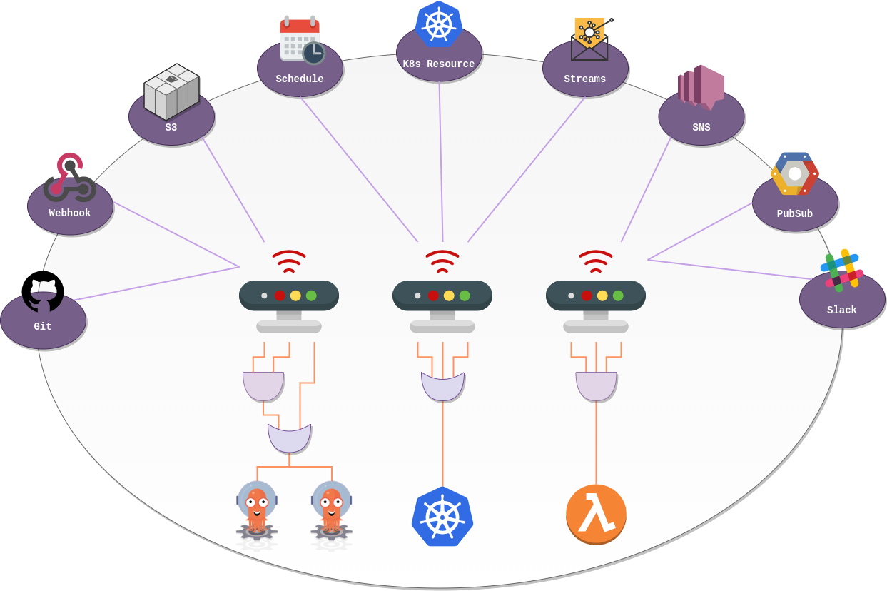

# Argo Events

Se trata de un framework de automatización _"event-driven"_ de Kubernetes que ayuda a ejecutar objetos de K8s, Argo Workflows y servicios serverless, entre otros, como se aprecia en la Figura 2.

Figura 2. Fuentes de Argo Events.

Para nuestro caso, usaremos Argo Events para la detección de cambios en un repositorio; de forma que, al detectarse un evento de `commit` en el repo, Argo Events recibirá el webhook desde el repositorio Git para activar el Workflow de nuestro pipeline. Para lograrlo, tendremos que configurar 3 tipos de objetos:

1. `EventSource`:
2. `Sensor`:
3. `Trigger`: 

Como estamos usando un patrón basado en GitOps, los manifiestos que desplegaremos de Argo Events se harán a través del repositorio Git que relacionamos en la sección anterior (Argo CD).

## 1. Event Source

El `EventSource` permite vincular el repositorio Git con nuestro clúster de Kubernetes (donde tenemos desplegado el ecosistema de Argo Project). 

## 2. Sensor

