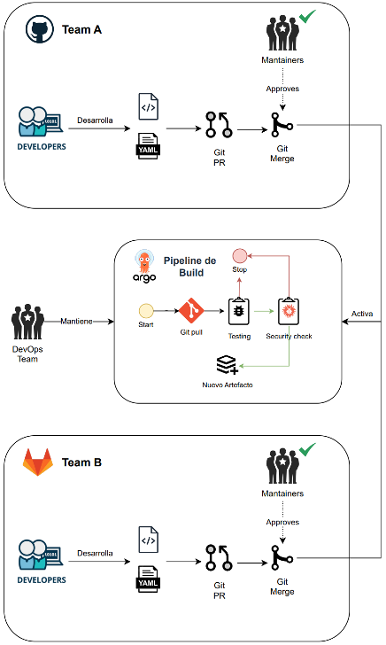

# Argo Workflows

Es una herramienta para la gestión la orquestación paralela de _jobs_ en Kubernetes. Está diseñado para ejecutar cada step a través de técnicas de contenerización y DAG. 

## 1. Estructura del repositorio

Antes de empezar, recordemos la estructura base de nuestro repositorio:

```text
<repo>/
  ├── argo/
  |     ├── workflows/
  |     |       ├── README.md
  |     |       ├── kustomization.yaml
  |     ├── events/
  |     |       ├── README.md
  |     |       ├── kustomization.yaml
  |     ├── kustomization.yaml
LICENSE
README.md
```

Todos los manifiestos de K8s de Argo Workflows que vamos a gestionar los crearemos en el path: `argo/workflows`.

## 2. Argo Server + Prerrequisitos

Similar a Argo CD, Argo Workflows también cuenta con una UI que mejora la experiencia del desarrollador (DevEx). Puedes acceder a la consola haciendo [click aquí]({{TRAFFIC_HOST1_2746}}).

### 2.1. MinIO

MinIO es un _"Object Storage"_ similar, y compatible, a AWS S3. Sirve para almacenar objetos (blobs) de cualquier tipo. En nuestro caso, lo usaremos para almacenar los artefactos reutilizables derivados de la ejecución de pipelines.

Para acceder a la consola de MinIO, puedes hacer [click aquí]({{TRAFFIC_HOST1_9090}}).

Las credenciales de conexión son:

* __Username:__ admin
* __Password:__ ejecuta el siguiente comando para conocer la contraseña:

```bash
k get secret -n argo-artifacts argo-artifacts -o jsonpath="{.data.root-password}" | base64 -d
```{{exec}}

Ahora, entraremos al servicio y crearemos un bucket que llamaremos `pipeline-artifacts-bucket`, que será donde almacenaremos nuestros artefactos.

#### 2.1.1 Configuración en Argo

Ahora que tenemos nuestro _Object Storage_ y un bucket registrado, debemos relacionarlo con Argo para que, cada vez que se cree un artefacto, lo almacene allí. Para ello, debemos crear el siguiente `ConfigMap` que se relacionará con los pipelines ejecutados de forma automática.

```yaml
apiVersion: v1
kind: ConfigMap
metadata:
  name: artifact-repositories
  namespace: argo
  annotations:
    workflows.argoproj.io/default-artifact-repository: default-artifact-repository
data:
  default-artifact-repository: |
    s3:
      bucket: pipeline-artifacts-bucket
      endpoint: argo-artifacts.argo-artifacts.svc.cluster.local:9000
      insecure: true
      accessKeySecret:
        name: minio-creds
        key: accesskey
      secretKeySecret:
        name: minio-creds
        key: secretkey
```{{copy}}

Requeriremos usar nuestro token de GitHub, configurado en la sección anterior, para clonar los repositorios de interés. Para ello, lo registraremos como un secreto del clúster a través del siguiente comando:

```bash
k create secret generic -n argo github-creds --from-literal=username=$GITHUB_USERNAME --from-literal=token=$GITHUB_TOKEN
```{{exec}}

### 2.2. Configuración RBAC

La ejecución de `Workflows` emplea un `serviceaccount` para su ejecución. Si no se especifica, usará el valor por `default`. En condiciones normales, esto no funcionará dado que las últimas versiones de Kubernetes emplean el __principio de mínimos privilegios__. Debido a ello, es necesario configurar un `serviceaccount` por cada `namespace` que contenga los permisos necesarios para la ejecución de sus opearciones.

En nuestro caso, configuraremos el siguiente `serviceaccount` y `namespace`:

```yaml
apiVersion: v1
kind: Namespace
metadata:
  name: inversion
spec: {}
status: {}
```{{copy}}

```yaml
apiVersion: v1
kind: ServiceAccount
metadata:
  name: argo-workflow
  namespace: inversion
```{{copy}}

Ahora, asociaremos el `ClusterRole` de `admin` de la siguiente forma:

```yaml
apiVersion: rbac.authorization.k8s.io/v1
kind: RoleBinding
metadata:
  name: inversiones-admin
  namespace: inversion
roleRef:
  apiGroup: rbac.authorization.k8s.io
  kind: ClusterRole
  name: admin
subjects:
- kind: ServiceAccount
  name: argo-workflow
  namespace: inversion
```{{copy}}


## 3. Cluster Templates

Nuestra misión detrás de esta iniciativa es disminuir la carga cognitiva de los equipos de desarrollo en la gestión de pipelines. Lo anterior quiere decir que requerimos consturir pipelines de uso transversal, que impacte la mayoría de los proyectos de software y que evite la necesidad de que los equipos los gestionen por sí mismo; pero, a su vez, que les permita acceder a los logs del pipeline para identificar si existe alguna oportunidad de mejora de su parte.

Para lograrlo, crearemos `ClusterWorkflowTemplates`, que se tratan de CRDs de K8s con los que podemos generalizar la lógica de pipelines y replicarla en cualquier proyecto de software dentro del clúster. A modo de ejemplo, crearemos el pipeline convencional descrito en la Figura 2.



Figura 2. Pipeline de Build.

Como se aprecia en la Figura 2, el pipeline consiste de los siguientes _steps_:

1. __Git clone:__ inicia con la clonación del repositorio de interés. 
2. __Testing:__ ejecuta el set de test unitarios. Normlamente, se envía a un producto externo, vía API's para la ejecución de análisis estático de código.
3. __Security check:__ ejecuta escaneo de vulnerabilidades de código.
4. __Nuevo artefacto:__ genera y publica un nuevo artefacto versionado del desarrollo.

El template que reune todos los steps numerados con anterioridad se puede apreciar a continuación:

```yaml
apiVersion: argoproj.io/v1alpha1
kind: ClusterWorkflowTemplate
metadata:
  name: ci-pipeline
spec:
  entrypoint: pipeline
  serviceAccountName: argo-workflow
  onExit: notify
  arguments:
    parameters:
      - name: repo_url             
      - name: revision             
      - name: context_dir          
      - name: image                
      - name: image_tag            
  volumes:
    - name: workspace
      emptyDir: {}
  templates:
    - name: pipeline
      dag:
        tasks:
          - name: clone
            templateRef:
                name: workflow-clone-template
                template: git-clone
                clusterScope: true
          - name: testing
            template: lint
            dependencies: [clone]
          - name: security_checks
            template: test
            dependencies: [clone]
          - name: build-image
            template: build-image
            dependencies: [testing, security_checks]
```{{copy}}

### 3.1. Git clone

Para la clonación del repositorio, usaremos un contenedor cuya imagen base pueda ejecutar operaciones `git`. El template se puede apreciar a continuación.

```yaml
apiVersion: argoproj.io/v1alpha1
kind: ClusterWorkflowTemplate
metadata:
  name: workflow-clone-template
spec:
  templates:
  - name: git-clone
    inputs:
        parameters:
          - name: repo_url
            value: "{{workflow.parameters.repo_url}}"
          - name: revision
            value: "{{workflow.parameters.revision}}"
      container:
        image: alpine/git:2.45.2
        workingDir: /workspace
        volumeMounts:
          - name: workspace
            mountPath: /workspace
        env:
          - name: GIT_TOKEN
            valueFrom:
              secretKeyRef:
                name: github-creds
                key: token
        command: [sh, -euxc]
        args:
          - |
            repo="{{inputs.parameters.repo_url}}"
            rev="{{inputs.parameters.revision}}"
            # If the repo URL is HTTPS GitHub, inject token (PAT or fine-grained token)
            if echo "$repo" | grep -q 'https://github.com/'; then
              repo="$(echo "$repo" | sed "s#https://#https://${GIT_TOKEN}@#")"
            fi
            git clone --depth 1 --branch "$rev" "$repo" src
      outputs:
        artifacts:
        - name: repo
          path: /workspace/src
```{{copy}}

### 3.2. Calidad

Para la evaluación de la calidad del software, utilizaremos el siguiente template:

```yaml
apiVersion: argoproj.io/v1alpha1
kind: Workflow
metadata:
  generateName: artifact-passing-
  namespace: argo
spec:
  serviceAccountName: argo-workflow
  entrypoint: clone-example
  arguments:
    parameters:
      - name: repo_url             
      - name: revision                       
  volumes:
    - name: workspace
      emptyDir: {}
  templates:
  - name: clone-example
    dag:
      tasks:
        - name: clone
          templateRef:
              name: workflow-clone-template
              template: git-clone
              clusterScope: true
```{{copy}}
